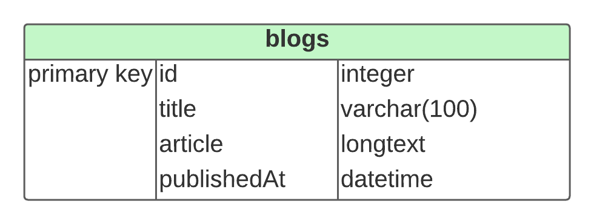

<h1 align="center"> <br> Asulside </h1>

> Projeto desenvolvido por: Roberta Meyrelles França, graduanda do 5° período de Ciência da Computação. 

## 📷 Página Inicial


## Tabela de Conteúdos
* [Descrição](#descrição)
* [Apresentação](#apresentação)

* [Documentação](#documentação)
* [Tecnologias e Ferramentas Utilizadas](#tecnologias-e-ferramentas-utilizadas)


## Descrição

Projeto de um blog desenvolvido para submissão no segundo bimestre da disciplina Programação Avançada para WEB, ministrada no quinto período do curso de Ciência da Computação.


O blog chamado **Asulside** é voltado para literatura e possuí posts sobre vários assuntos envolvendo esse mundo, como: resenhas e indicações de leituras. 

Em sua página principal temos a visualização dos últimos posts feitos, assim como a possibilidade da criação de um novo post através do editor e uma página com informações sobre o Asulside.  


## Apresentação

+ Apresentação das funcionalidades: [Link](https://youtu.be/zxh3d81QOCM)

+ Código no Repl.it: [Link](https://replit.com/@RobertaMeyrelle/Asulside)


## Documentação 

O projeto possuí uma tabela chamada **blogs** e abaixo podemos ver o diagrama Entidade Relacionamento relacionado a ela:


A database foi criada através do site RemoteMySQl no phpMyAdmin e nele criamos a nossa base de dados utilizando MySQL. 

```
CREATE TABLE blogs(
  id INTEGER NOT NULL PRIMARY KEY AUTO_INCREMENT,
  title  VARCHAR(100) NOT NULL, 
  article LONGTEXT NOT NULL, 
  publishedAt DATETIME NOT NULL
);

CREATE INDEX idx_blogs_created ON blogs(publishedAt); 
```

Ao realizarmos o **```SELECT * FROM blogs```**, serão retornados esses dados atualmente:

| id        |title     |article   |  publishedAt |
|-----------|----------|----------|----------| 
|1       |RM's Reading List| Kim Namjoon, also known by his stage name RM, is t...      | 2022-06-06 22:10:39
|2         |SPY X Family|Spy × Family (スパイファミリー Supai Famirī) é uma série j...      | 2022-06-06 21:54:25
|3       |Haikyuu | Haikyuu! é uma série de mangá escrita e ilustrada ...      | 2022-06-06 22:22:23


## Tecnologias e Ferramentas Utilizadas

+ SGBD MySQL
+ Golang
+ HTML5
+ CSS3
+ JavaScript
+ RemoteMySQL
+ phpMyAdmin
+ Template desenvolvido por [Modern Web](https://github.com/kunaal438/blogging-site)